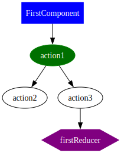
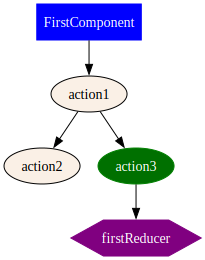
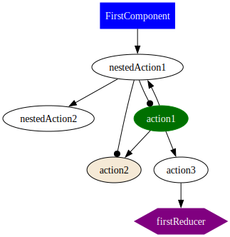
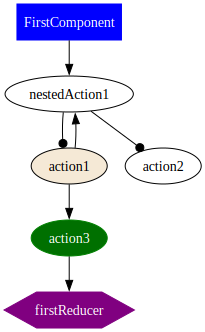
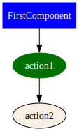
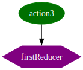
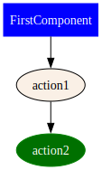
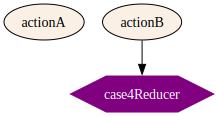
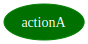

# ngrx-graph

CLI to scan an Angular NgRx codebase and produce a structure JSON and DOT/SVG graphs.

## Motivation:

Working with a very big [NgRx](https://ngrx.io/) store in an angular application will lead to having lots of actions/effects and lots of interactions between components/actions/reducers. It gets very tedious very quickly to follow an action from the start to the end, and it is very easy to miss an action dispatched in an effect somewhere along the chain of actions.

This package tries to collect all actions/components/reducers participating in a particular flow and generate dot files for that flow, with the idea that following a graph visually is easier than following effects and actions in code.

It is also possible to see the whole net with all actions/components/reducers, but that is more important is to follow a particular action from the start to the end (the optional argument)

## Notes

- The CLI always writes the JSON payload to the file specified by `--out` (default: `ngrx-graph.json`).
- DOT and SVG files are written under the directory specified by `--dir`.
- DOT files are generated only when `--dot` or `--svg` is passed. Use `--json` to re-generate the JSON first; combine with `--dot`/`--svg` to continue generating DOT/SVG.
- Default concurrency: the CLI computes a sensible default of `max(1, CPU_COUNT - 2)` (number of CPUs minus two, minimum 1). This keeps CPU available for other tasks while enabling parallel parsing. Override with `-c/--concurrency <n>`.
- Prefer viz.js for SVG: pass `--viz` to prefer using viz.js (a WASM/JS renderer) for SVG generation. With `--viz` the CLI tries viz.js first and falls back to Graphviz `dot` if viz.js fails. Without `--viz` the CLI prefers the native `dot` executable and uses viz.js only as a fallback.

<details>
  <summary>Quick start</summary>

Install globally (optional):

```bash
npm install -g ngrx-graph
# or run with npx: npx ngrx-graph ...
```

Quick examples

- Generate the structure JSON (always written to `--out`, default `ngrx-graph.json`):

```bash
ngrx-graph -d ./src --out ./out
# writes: ./out/ngrx-graph.json
```

- Generate an action-focused DOT (and optional SVG):

```bash
ngrx-graph "MyAction" -d ./src --out ./out --dot --svg
```

- Generate a single aggregated DOT for the whole project (writes `all.dot`):

```bash
ngrx-graph -a -d ./src --out ./out --dot --svg
```

- Re-generate the JSON only (stop after JSON):

```bash
ngrx-graph -d ./src --out ./out --json
```

```bash
ngrx-graph -d ./src --out ./out
```

Note: caching is enabled by default. To force a re-scan and regenerate the JSON payload, pass `-f` or `--force`.

Common flags: `-d/--dir`, `-o/--out`, `-a/--all`, `-s/--svg`, `-j/--json`, `-v/--verbose`, `-c/--concurrency`, `-f/--force`
</details>
<details>
  <summary>Graph Keys</summary>

|                 |                                              |
| --------------- | -------------------------------------------- |
| Component       |       |
| Action          |          |
| Action in focus |  |
| Nested Action   |    |
| Reducer         |         |

</details>

<details>
  <summary>Examples</summary>

### Case 1:

### Input:

Input files (see the canonical example sources under `docs/examples/case1/src`):

- Actions: `docs/examples/case1/src/case1.actions.ts`
- Component: `docs/examples/case1/src/case1.component.ts`
- Effects: `docs/examples/case1/src/case1.effects.ts`
- Reducer: `docs/examples/case1/src/case1.reducer.ts`

### Output:

```bash
npx ngrx-graph -j
````

- [ngrx-graph.json](./docs/examples/case1/out/ngrx-graph.json)

```bash
npx ngrx-graph action1
```

- [dotFile](./docs/examples/case1/out/action1.dot)
- graph:  
  

```bash
npx ngrx-graph action3
```

- [dotFile](./docs/examples/case1/out/action3.dot)
- graph:  
  

### Case 2 (nested actions):

### Input:

Input files (see the canonical example sources under `docs/examples/case2/src`):

- Actions: `docs/examples/case2/src/case2.actions.ts`
- Component: `docs/examples/case2/src/case2.component.ts`
- Effects: `docs/examples/case2/src/case2.effects.ts`
- Reducer: `docs/examples/case2/src/case2.reducer.ts`

### Output:

```bash
npx ngrx-graph -j
```

- [ngrx-graph.json](./docs/examples/case2/out/ngrx-graph.json)

```bash
npx ngrx-graph action1
```

- [dotFile](./docs/examples/case2/out/action1.dot)
- graph:  
  

```bash
npx ngrx-graph action3
```

- [dotFile](./docs/examples/case2/out/action3.dot)
- graph:  
  

### Case 3 (reachability filtering):

### Input:

Input files (see the canonical example sources under `docs/examples/case3/src`):

- Actions: `docs/examples/case3/src/case3.actions.ts`
- Component: `docs/examples/case3/src/case3.component.ts`
- Effects: `docs/examples/case3/src/case3.effects.ts`
- Reducer: `docs/examples/case3/src/case3.reducer.ts`

### Output:

```bash
npx ngrx-graph -j
```

- [ngrx-graph.json](./docs/examples/case3/out/ngrx-graph.json)

```bash
npx ngrx-graph action1
```

- [dotFile](./docs/examples/case3/out/action1.dot)
- graph:  
  

```bash
npx ngrx-graph action3
```

- [dotFile](./docs/examples/case3/out/action3.dot)
- graph:  
  

```bash
npx ngrx-graph action2
```

- [dotFile](./docs/examples/case3/out/action2.dot)
- graph:  
  

### Case 4 (aliases and re-exports):

### Input:

Input files (see the canonical example sources under `docs/examples/case4/src`):

- Actions: `docs/examples/case4/src/case4.actions.ts`
- Barrel / re-exports: `docs/examples/case4/src/index.ts`
- Component: `docs/examples/case4/src/case4.component.ts`
- Effects: `docs/examples/case4/src/case4.effects.ts`
- Reducer: `docs/examples/case4/src/case4.reducer.ts`

### Output:

```bash
npx ngrx-graph -j
```

- [ngrx-graph.json](./docs/examples/case4/out/ngrx-graph.json)

Generate a combined graph for the whole example:

```bash
npx ngrx-graph -a -d docs/examples/case4/src -o docs/examples/case4/out
```

- [combined DOT](./docs/examples/case4/out/all.dot)
- combined graph:  
  

Generate a graph for a specific action (produces per-action DOT only when an action is supplied):

```bash
npx ngrx-graph actionA -d docs/examples/case4/src -o docs/examples/case4/out
```

- [dotFile](./docs/examples/case4/out/actionA.dot)
- graph:  
  

</details>

<details>
  <summary>Usage</summary>

<!-- usage -->
```sh-session
$ npm install -g ngrx-graph
$ ngrx-graph COMMAND
running command...
$ ngrx-graph (--version)
ngrx-graph/1.0.1 darwin-arm64 node-v24.12.0
$ ngrx-graph --help [COMMAND]
USAGE
  $ ngrx-graph COMMAND
...
```
<!-- usagestop -->
</details>

<details>
  <summary>Commands</summary>

<!-- commands -->
* [`ngrx-graph [ACTION]`](#ngrx-graph-action)
* [`ngrx-graph help [COMMAND]`](#ngrx-graph-help-command)
* [`ngrx-graph [ACTION]`](#ngrx-graph-action)

## `ngrx-graph [ACTION]`

Generate NgRx actions graph

```
USAGE
  $ ngrx-graph graph [ACTION]

FLAGS
  -a, --all                  only generate the aggregated all.dot (no per-action files)
  -c, --concurrency=<value>  [default: 8] concurrency for file parsing
  -d, --dir=<value>          [default: /Users/anajjar/code/ngrx-graph] Directory to scan
  -f, --force                regenerate JSON payload and ignore any cached ngrx-graph.json (forces a re-scan)
  -j, --json                 scan and write ngrx-graph.json only (no DOT/SVG)
  -o, --out=<value>          [default: ngrx-graph.json] output JSON file name (placed in --dir)
  -s, --svg                  also generate SVG files from DOT (requires Graphviz `dot` on PATH)
  -v, --verbose              enable verbose logging
      --dot                  also generate DOT files (per-action and aggregated)
      --viz                  prefer viz.js for SVG generation (useful when dot is unavailable)

DESCRIPTION
  Generate NgRx actions graph

  Examples:


  # Scan a project and write JSON into the output directory (file: ngrx-graph.json)
  $ ngrx-graph -d ./src --out ./out

  # Generate aggregated DOT and SVG (all.dot / all.svg) under the output directory
  $ ngrx-graph -d ./src --out ./out --all --svg

  # Generate focused DOT/SVG for a specific action (positional argument)
  $ ngrx-graph "MyAction" -d ./src --out ./out --svg

  # Re-generate JSON and stop (writes ./out/ngrx-graph.json)
  $ ngrx-graph -d ./src --out ./out --json

  # Reuse an existing JSON payload instead of re-scanning
  $ ngrx-graph -d ./src --out ./out

  # Generate DOT files only (per-action and aggregated)
  $ ngrx-graph -d ./src --out ./out --dot

  # Generate SVGs (implies DOT generation)
  $ ngrx-graph -d ./src --out ./out --svg

  Notes:

  - The CLI always writes the JSON payload to a file named 'ngrx-graph.json' inside the directory specified by '--out'
  (defaults to the scan directory).
  - DOT and SVG files are written under the directory specified by '--dir' (scan directory) unless you prefer to write
  them under '--out'.
  - Use '--json' to re-generate the JSON and stop (no DOT/SVG) when used alone.
  - Note: caching is enabled by default. To force a re-scan and regenerate the JSON payload, pass -f or --force.

EXAMPLES
  $ ngrx-graph -d ./src --out ./out

  $ ngrx-graph -d ./src --out ./out --all --svg

  $ ngrx-graph "MyAction" -d ./src --out ./out --svg

  $ ngrx-graph -d ./src --out ./out --json

  $ ngrx-graph -d ./src --out ./out

  $ ngrx-graph -d ./src --out ./out --dot

  $ ngrx-graph -d ./src --out ./out --svg
```

_See code: [src/commands/graph.ts](https://github.com/ammarnajjar/ngrx-graph/blob/v1.0.1/src/commands/graph.ts)_

## `ngrx-graph help [COMMAND]`

Display help for ngrx-graph.

```
USAGE
  $ ngrx-graph help [COMMAND...] [-n]

ARGUMENTS
  [COMMAND...]  Command to show help for.

FLAGS
  -n, --nested-commands  Include all nested commands in the output.

DESCRIPTION
  Display help for ngrx-graph.
```

_See code: [@oclif/plugin-help](https://github.com/oclif/plugin-help/blob/v6.2.36/src/commands/help.ts)_

## `ngrx-graph [ACTION]`

Generate NgRx actions graph

```
USAGE
  $ ngrx-graph Symbol(SINGLE_COMMAND_CLI) [ACTION]

FLAGS
  -a, --all                  only generate the aggregated all.dot (no per-action files)
  -c, --concurrency=<value>  [default: 8] concurrency for file parsing
  -d, --dir=<value>          [default: /Users/anajjar/code/ngrx-graph] Directory to scan
  -f, --force                regenerate JSON payload and ignore any cached ngrx-graph.json (forces a re-scan)
  -j, --json                 scan and write ngrx-graph.json only (no DOT/SVG)
  -o, --out=<value>          [default: ngrx-graph.json] output JSON file name (placed in --dir)
  -s, --svg                  also generate SVG files from DOT (requires Graphviz `dot` on PATH)
  -v, --verbose              enable verbose logging
      --dot                  also generate DOT files (per-action and aggregated)
      --viz                  prefer viz.js for SVG generation (useful when dot is unavailable)

DESCRIPTION
  Generate NgRx actions graph

  Examples:


  # Scan a project and write JSON into the output directory (file: ngrx-graph.json)
  $ ngrx-graph -d ./src --out ./out

  # Generate aggregated DOT and SVG (all.dot / all.svg) under the output directory
  $ ngrx-graph -d ./src --out ./out --all --svg

  # Generate focused DOT/SVG for a specific action (positional argument)
  $ ngrx-graph "MyAction" -d ./src --out ./out --svg

  # Re-generate JSON and stop (writes ./out/ngrx-graph.json)
  $ ngrx-graph -d ./src --out ./out --json

  # Reuse an existing JSON payload instead of re-scanning
  $ ngrx-graph -d ./src --out ./out

  # Generate DOT files only (per-action and aggregated)
  $ ngrx-graph -d ./src --out ./out --dot

  # Generate SVGs (implies DOT generation)
  $ ngrx-graph -d ./src --out ./out --svg

  Notes:

  - The CLI always writes the JSON payload to a file named 'ngrx-graph.json' inside the directory specified by '--out'
  (defaults to the scan directory).
  - DOT and SVG files are written under the directory specified by '--dir' (scan directory) unless you prefer to write
  them under '--out'.
  - Use '--json' to re-generate the JSON and stop (no DOT/SVG) when used alone.
  - Note: caching is enabled by default. To force a re-scan and regenerate the JSON payload, pass -f or --force.

EXAMPLES
  $ ngrx-graph -d ./src --out ./out

  $ ngrx-graph -d ./src --out ./out --all --svg

  $ ngrx-graph "MyAction" -d ./src --out ./out --svg

  $ ngrx-graph -d ./src --out ./out --json

  $ ngrx-graph -d ./src --out ./out

  $ ngrx-graph -d ./src --out ./out --dot

  $ ngrx-graph -d ./src --out ./out --svg
```

_See code: [src/commands/Symbol(SINGLE_COMMAND_CLI).ts](https://github.com/ammarnajjar/ngrx-graph/blob/v1.0.1/src/commands/Symbol(SINGLE_COMMAND_CLI).ts)_
<!-- commandsstop -->

</details>

<details>
  <summary>Version Release Guide</summary>

- change version in [`package.json`](package.json)
- run `npm run version`
- run `./scripts/test-npm-pack.sh` to check that package would work if published.
- commit and push/merge to main
- draft and release a release on [github](https://github.com/ammarnajjar/ngrx-graph/releases/new)
</details>

# Status:

This project is still young and it encourages collaborations. If you have an ideas/questions/fixes please do not hesitate to open an issue or provide a pull request.

I work on this on my own free time only.
