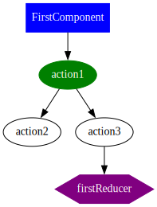

# ngrx-graph

## Motivation:

Working with a very big [NgRx](https://ngrx.io/) store in an angular application will lead to having lots of actions/effects and lots of interactions between components/actions/reducers. It gets very tedious very quickly to follow an action from the start to the end, and it is very easy to miss an action dispatched in an effect somewhere along the chain of actions.

This packages, tries to collect all actions/components/reducers participating in a particular flow and generate dot files for that flow, with the idea that following a graph visually is easier than following effects and actions in code.

It is also possible to see the whole net with all actions/components/reducers, but that is more important is to follow a particular action from the start to the end (the optional argument)

## How it works

This package generates dot files representing the interaction between ngrx actions, components, effects and reducers.

Dot files can be then used to generate graphs using [Graphviz](https://www.graphviz.org/), so this needs to be installed first, e.g:

```bash
for file in *.dot; do; dot -Tsvg $file -o "${file%.*}".svg; rm $file; done
```

The first run will generate a json file (see `--structureFile` flag), which is used for the next runs if the flag `--force` was not set as cache.
If this file exists, source code will not be parsed for actions, the recorded structure will be taken from that json file. This speeds up the process considerably.

<details>
  <summary>Graph Keys</summary>

|                 |                                              |
| --------------- | -------------------------------------------- |
| Component       |       |
| Action          |          |
| Action in focus |  |
| Nested Action   |    |
| Reducer         |         |

</details>
<details>
  <summary>Examples</summary>

### Case 1:

### Input:

```typescript
// actions
export const action1 = createAction('Action1');
export const action2 = createAction('Action2');
export const action3 = createAction('Action3');

// component
@Component()
export class FirstComponent {
  onEvent() {
    this.store.dispatch(action1());
  }
}

// effects
@Injectable()
export class ExampleEffects {
  effect1$ = createEffect(() =>
    this.actions$.pipe(
      ofType(action1),
      switchMap(() => [action2(), action3()]),
    ),
  );
}

// reducer
const firstReducer = createReducer(
  on(action3, () => {
    // ...
  }),
);
```

### Output:

```bash
npx ngrx-graph -j -f
```

- [ngrx-graph.json](./docs/examples/case1/ngrx-graph.json)

```bash
npx ngrx-graph action1
```

- [dotFile](./docs/examples/case1/action1.dot)
- graph:  
  

```bash
npx ngrx-graph action3
```

- [dotFile](./docs/examples/case1/action3.dot)
- graph:  
  

### Case 2 (nested actions):

### Input:

```typescript
// actions
export const nestedAction = createAction(
  'NestedAction',
  props<{ action: Action }>(),
);
export const action1 = createAction('Action1');
export const action2 = createAction('Action2');
export const action3 = createAction('Action3');

// component
@Component()
export class FirstComponent {
  onEvent() {
    this.store.dispatch(nestedAction({ action: action1() }));
  }
}

// effects
@Injectable()
export class ExampleEffects {
  effect1$ = createEffect(() =>
    this.actions$.pipe(
      ofType(action1),
      switchMap(() => [nestedAction1({ action: action2() }), action3()])),
    ),
  );

  effect2$ = createEffect(() =>
    this.actions$.pipe(
      ofType(nestedAction1),
      map(({ action }) => nestedAction2( { action: action()})),
    ),
  );

  effect3$ = createEffect(() =>
    this.actions$.pipe(
      ofType(nestedAction2),
      map(({ action }) => action())),
    ),
  );
}

// reducer
const firstReducer = createReducer(
  on(action3, () => {
    // ...
  }),
)
```

### Output:

```bash
npx ngrx-graph -j -f
```

- [ngrx-graph.json](./docs/examples/case2/ngrx-graph.json)

```bash
npx ngrx-graph action1
```

- [dotFile](./docs/examples/case2/action1.dot)
- graph:  
  

```bash
npx ngrx-graph action3
```

- [dotFile](./docs/examples/case2/action3.dot)
- graph:  
  

</details>

<details>
  <summary>Usage</summary>

<!-- usage -->
```sh-session
$ npm install -g ngrx-graph
$ ngrx-graph COMMAND
running command...
$ ngrx-graph (--version)
ngrx-graph/0.0.12 darwin-arm64 node-v22.9.0
$ ngrx-graph --help [COMMAND]
USAGE
  $ ngrx-graph COMMAND
...
```
<!-- usagestop -->
</details>

<details>
  <summary>Commands</summary>

<!-- commands -->
* [`ngrx-graph graph [ACTION]`](#ngrx-graph-graph-action)
* [`ngrx-graph help [COMMAND]`](#ngrx-graph-help-command)

## `ngrx-graph graph [ACTION]`

Generate NgRx actions graph

```
USAGE
  $ ngrx-graph graph [ACTION] [-a] [-f] [-j] [-o <value>] [-d <value>] [-s <value>]

ARGUMENTS
  ACTION  Action of interest. It will be ignored if --jsonOnly is used

FLAGS
  -a, --all                    Generate the whole graph for all actions and connected component, effects and reducers.
                               It will be ignored if --jsonOnly is used
  -d, --srcDir=<value>         [default: current directory] Source directory to grab actions from, usually the directory
                               with package.json in it
  -f, --force                  Force regenrating the graph structure
  -j, --jsonOnly               Generate only the structure json file, can be combined with --structureFile option. It
                               overrides --all and [ACTION]
  -o, --outputDir=<value>      [default: /tmp] Destination directory, where to save the generated files
  -s, --structureFile=<value>  [default: ngrx-graph.json] Then name of the structure json file, Path is taken from
                               --outputDir option

DESCRIPTION
  Generate NgRx actions graph

EXAMPLES
  $ ngrx-graph graph
```

_See code: [src/commands/graph/index.ts](https://github.com/ammarnajjar/ngrx-graph/blob/v0.0.12/src/commands/graph/index.ts)_

## `ngrx-graph help [COMMAND]`

Display help for ngrx-graph.

```
USAGE
  $ ngrx-graph help [COMMAND...] [-n]

ARGUMENTS
  COMMAND...  Command to show help for.

FLAGS
  -n, --nested-commands  Include all nested commands in the output.

DESCRIPTION
  Display help for ngrx-graph.
```

_See code: [@oclif/plugin-help](https://github.com/oclif/plugin-help/blob/v6.2.14/src/commands/help.ts)_
<!-- commandsstop -->
</details>

# Status:

This project is still young and it encourages collaborations. If you have an ideas/questions/fixes please do not hesitate to open an issue or provide a pull request.

I work on this on my own free time only.
